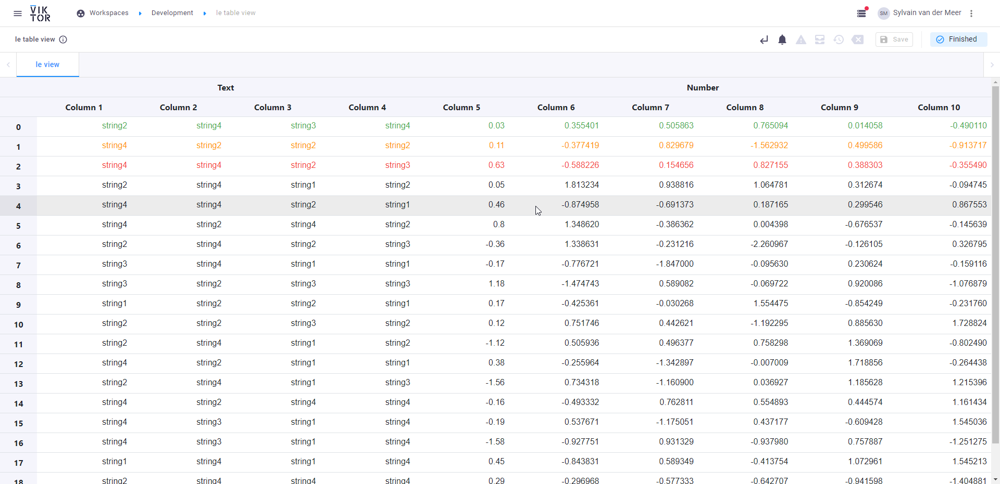

# Table view (open-source view for VIKTOR)
This repository can be installed in a VIKTOR application to show nicely formatted tables. 



# Installation
Paste the link of this repository in your `requirements.txt`:
```text
viktor==14.4.0
git+https://github.com/viktor-platform/viktor_table_view.git
```

# Example implementation
The following could be an implementation of the `TableView` (`app.py`)

```python
import numpy as np
import pandas as pd
from viktor import ViktorController

from viktor_table_view import TableResult
from viktor_table_view import TableView


class SampleEntity(ViktorController):
    label = "SampleEntity"

    @TableView("le view", duration_guess=1)
    def le_view(self, **kwargs):
        # Generate the data

        data = np.random.randn(20, 6)
        strings = np.array(["string1", "string2", "string3", "string4"])
        string_data = np.random.choice(strings, size=(20, 4))

        # Create the headers
        headers1 = ["Text"] * 4 + ["Number"] * 6
        headers2 = [f"Column {index + 1}" for index in range(0, 10)]

        # Combine the headers and data into a dataframe
        df = pd.DataFrame(np.column_stack([string_data, data]), columns=[headers1, headers2])
        df.iloc[:, 4:] = df.iloc[:, 4:].astype(float)
        df_colours = df.copy(deep=True)
        df_colours.iloc[0, :] = "success"
        df_colours.iloc[1, :] = "warning"
        df_colours.iloc[2, :] = "error"
        df_colours.iloc[3:, :] = pd.NA
        return TableResult(df, dataframe_colours=df_colours, n_decimals={("Number", "Column 5"): 2})
```

# Contributing
Improvements to the view are very welcome. Please ensure your improvements adhere to the code standards by running 
black, isort and pylint (with the versions specified in `dev-requirements.txt`):
```shell
python -m black src/;
python -m isort src/;
python -m pylint src/ --rcfile=pyproject.toml;
```
